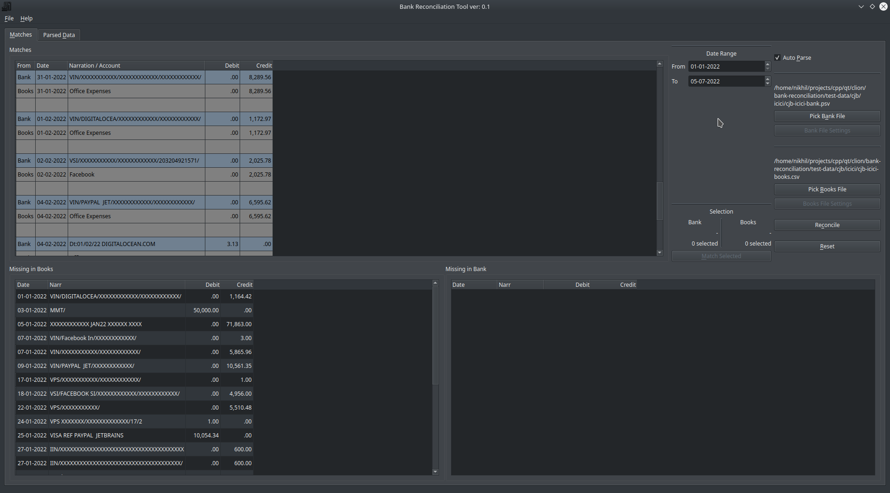

# Bank Reconciliation Tool

## Description

Diffs transactions from 2 files with delimited-values.
Useful for synchronizing the entries in books of accounts with bank statement.

Transactions in bank file will have their mode reversed (i.e. Amount reflected as `Credit` will be read as `Debit` and
vice versa.)

2 transactions are considered equal if their date and amounts match.
Dates are `std::tm` objects parsed in `dd/mm/yy` or `dd/mm/yyyy` formats. This will later be made more flexible.

Single matching entries are automatically populated, and missing entries are displayed in below tables respectively.

Multiple entries can also be matched by selecting the same mode of transaction:

`Debit -> Debit` or `Credit -> Credit`

Totals of selected entries will be reflected on the main window, and `Match Selected` moves them from `Missing in <XXX>`
to `Matches` table.

### Building:

- Requires Qt6 installed.

```sh
$ mkdir build && cd build
$ cmake ..
$ make
```

##### Note: if Qt isn't found, tell CMake where to find it with `-DCMAKE_PREFIX_PATH=/path/to/Qt`

### Project Layout

- bank-reconc-lib (included as shared-lib)
- src (qt ui)

#### Deploy on Windows:

    - build project
    - <QT_DIR>\<compiler>\bin\windeployqt.exe <BUILD_DIR>\BankReconcTool.exe

#### Screenshot



#### reach me at `nikhilchawla39@gmail.com`

